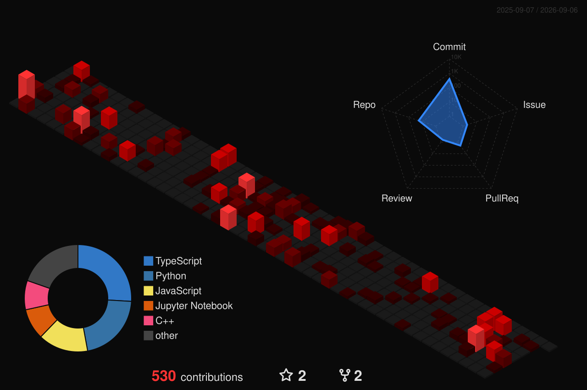

## My last Spotify track that’s still in my head...

  

<!-- --- -->

<!--

  

----->

<table align="center" width="100%">
  <tr>
    <td valign="top" width="68%">
      
    </td>
    <td valign="top" width="32%">
      

        
      

    </td>
  </tr>
</table>

 

---

  Building systems that understand privacy. Making music that doesn't.

